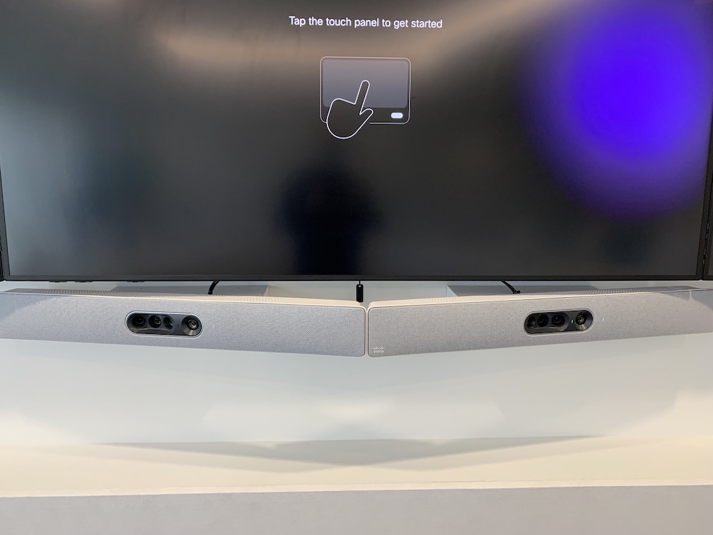
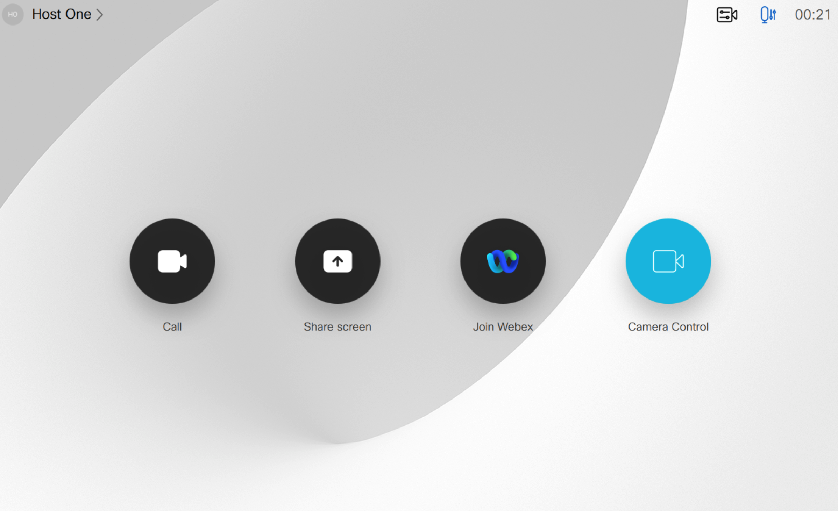
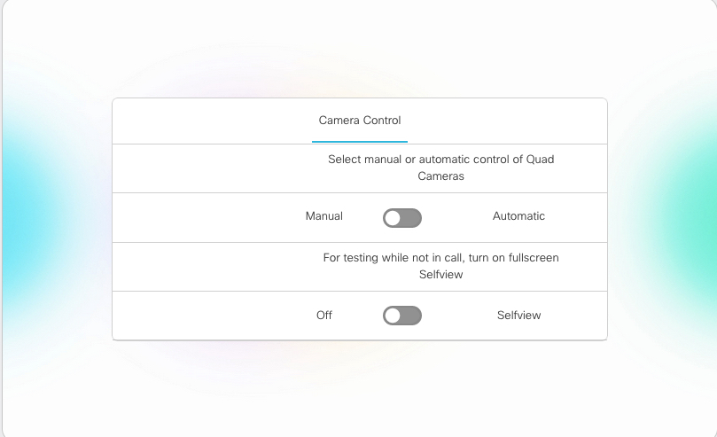

# GVE DevNet Webex Devices Executive Room Voice Activated Switching Macro
Webex Room Device macro to switch input source to camera pointed in the direction of the area of the room that has audio activity as detected by the table microphones in the zone. 

This macro is a variant of the QuadCam specific version found here: 
https://github.com/gve-sw/GVE_DevNet_WebexDevicesExecutiveRoomQuadCamSwitcherMacro
  
It features the following enhancements: 
- Simpler const variables to configure mic inputs and mapping to sources
- Live validation of source/mic mapping to reduce errors
- Support for P60 and 4K PTZ Cameras
- Support for SpeakerTrack 60 Camera arrays
- Support for using with only one main codec
- Support for re-initializing the macro after a camera firmware update
 

## Contacts
* Gerardo Chaves (gchaves@cisco.com)
* Enrico Conedera (econeder@cisco.com)

## Solution Components
* Webex Collaboration Endpoints
* Javascript
* xAPI

## Requirements
* Devices must be running RoomOS 10.8 or later

## Installation/Configuration
This sample includes 2 macros that can be installed on separate Webex Codecs to work in conjunction to cover a large executive 
room with 2 QuadCam cameras and other camera combinations given the limitation that only 1 QuadCam can be connected to a codec.

   
Example of a Quad Camera Cluster pointing a different areas of a large room.  
  
In that scenario, the first QuadCam is connected to the main 
codec (typically a Webex Codec Pro) and the second one to the auxiliary codec (typically a Webex Codec Plus) which in turn has it's HDMI 1 
video output connected to the main codec into it's HDMI 2 input. 
If you only have one Webex Codec and will not be trying to use 2 QuadCams,  you can just use one of the macros ('main_codec_macro.js') on 
that codec to control any allowed combination 4K PTZ cameras, a Cisco SpeakerTrack 60 camera array or a QuadCam camera.  
  
You can find technical drawings and connection diagrams for the most common scenarios supported by this macro here:
[Boardroom_2_0_System_Drawing_REV_3.pdf](Boardroom_2_0_System_Drawing_REV_3.pdf)

Notice that for the dual codec scenario, the camera input 2 on the Primary (Main) Codec comes from 
Output 1 on the Auxiliary codec since we are just using that codec to pass along the video from the QuadCam. 
Also notice that all microphones are connected to the Primary (Main) Codec since the macro running 
there is the one making all of the decisions on which camara to activate depending on audio activity. 

After the codecs, cameras and microphones are correctly connected do the following:
1) Edit your local version of files 'main_codec_macro.js' and 'aux_codec_macro.js' according to these instructions to configure the macros:  
[MainMacroInstructions.pdf](MainMacroInstructions.pdf)


2) Load the modified contents of 'main_codec_macro.js' as a new macro into the Macro editor of the main codec and the contents of the modified 'aux_codec_macro.js' 
into a new macro into the Macro editor of the auxiliary codec if applicable. 
'main_codec_macro.js' contains all of the logic to choose which input to select 
as well as the logic to make sure that the Aux codec is active and receiving the input from QuadCam2. 
If you are unfamiliar with Cisco Room device macros and how to manage them, this is a good article to get started: 
https://help.webex.com/en-us/np8b6m6/Use-of-Macros-with-Room-and-Desk-Devices-and-Webex-Boards  
   
3) Enable or "turn on" the newly created macron on the primary codec and the auxiliary codec if applicable. 
  
4) To be able to manually turn on and off the functionality of this macro from the Touch 10 device of the Main codec, please import the ```CameraManualOverride.xml``` file into the 
main codec using it's UI Extension Editor. Without this custom panel installed on the Main codec, you will see errors being logged by the 
   macro given that it updates the state of toggle buttons on it. If you are unfamiliar with UI Extensions and how to load them from the devices 
   web interface, visit this article: https://help.webex.com/en-us/n18glho/User-Interface-Extensions-with-Room-and-Desk-Devices-and-Webex-Boards . 
   You can find more details and screenshots also in this guide: https://www.cisco.com/c/dam/en/us/td/docs/telepresence/endpoint/roomos-103/desk-room-kit-boards-customization-guide-roomos-103.pdf
  
NOTE: The macro is written to hide the mid-call controls “Lock meeting” and “Record”.  The reason for this is so that the
 custom “Camera Control” button added above can be seen always in a call without having to press on the More.. button. 
If you prefer to have the mid-call controls always showing edit line 116 of the 'main_codec_macro.js' on the main codec that has the following config command:  
```
xapi.Config.UserInterface.Features.Call.MidCallControls.set("Hidden")
```  
and change the value in the string being sent as a parameter from “Hidden” to “Auto”


## Usage

Once the macros are loaded and activated, the correct video switching behavior should occur automatically every time a call connects.  

To manually turn on and off the Automatic switching based on microphone input across the two quad cams, you can use the panel installed on step 4 above; just press the Camera Control button on the Touch 10:




That should bring up the following Panel where you can select the behavior desired: 


  

The following actions with turn off the automatic behaviour for you in addition to manually turning it off:  
  
a) When a call disconnects  
b) Bringing the main codec out of half-wake mode  


### LICENSE

Provided under Cisco Sample Code License, for details see [LICENSE](LICENSE.md)

### CODE_OF_CONDUCT

Our code of conduct is available [here](CODE_OF_CONDUCT.md)

### CONTRIBUTING

See our contributing guidelines [here](CONTRIBUTING.md)

#### DISCLAIMER:
<b>Please note:</b> This script is meant for demo purposes only. All tools/ scripts in this repo are released for use "AS IS" without any warranties of any kind, including, but not limited to their installation, use, or performance. Any use of these scripts and tools is at your own risk. There is no guarantee that they have been through thorough testing in a comparable environment and we are not responsible for any damage or data loss incurred with their use.
You are responsible for reviewing and testing any scripts you run thoroughly before use in any non-testing environment.